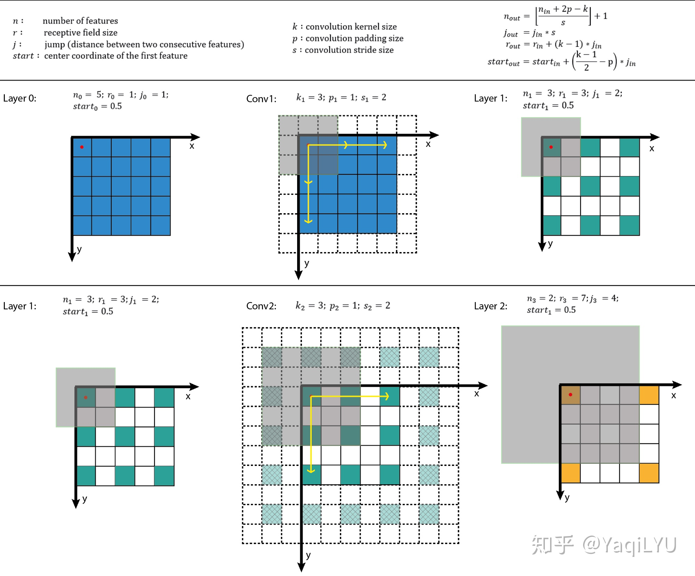

# 感受野

感受野四个核心公式：
$$n_{out} = \lfloor\frac{n_{in} - 2p - k}{s}\rfloor +1$$
$$j_{out} = j_{in} \times s$$
$$r_{out} = r_{in} + (k - 1) \times j_{in}$$
$$start_{out} = start_{in} + (\frac{k - 1}{2} - p) \times j_{in}$$

上式中n是feature map的大小，p是padding，k是kernel size，j是jump(前面的S)，r是感受野大小，start是第一个特征向量(左上角位置)对应感受野的中心坐标位置。搬运并翻译：

- 公式一是通用计算卷积层输入输出特征图大小的标准公式
- 公式二计算输出特征图的jump，等于输入特征图的jump乘当前卷积层的步进s
- 公式三计算感受野大小，等于输入感受野加当前层的卷积影响因子(k - 1) * jin，注意这里与当前层的步进s没有关系
- 公式四计算输出特征图左上角位置第一个特征向量，对应输入图像感受野的中心位置，注意这里与padding有关系  

从以上公式可以看出：start起始值为0.5，经过k=3, p=1时不变，经过k=5, p=2时不变。

